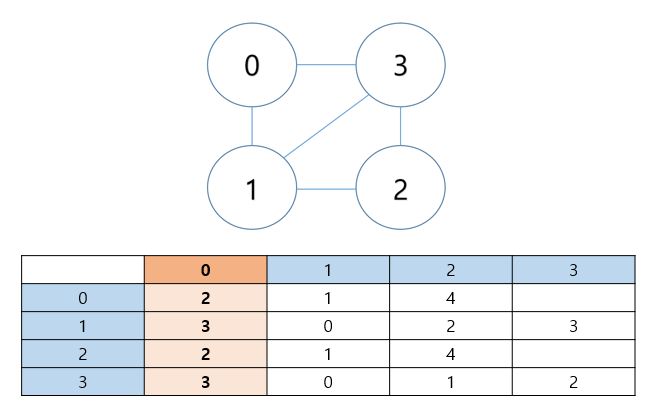

# 알고리즘

## 알고리즘 성능 측정
- 시간적 효율성을 우선시함  
- 수행되는 __명령어수__ 가 적을수록 시간적 효율성이 좋음  
- 빅오 표기법  
- 1초 동안 과연 몇 번의 연산을 할 수 있는가?  
- C언어 기준으로 __10의 9승__ 번 명령어가 수행되 면 1초가 걸린다.  

## 완전 탐색 - Brute Force
> 문제 해결을 위해 모든 경우의 수를 탐색   
> ex) 순차탐색, __경우의 수__ 문제  


* __백트래킹__ : 어느 지점에서 더이상 탐색이 필요없다고 판단될 때 탐색을 멈추고 이전 단계로돌아가서 다른 방법을 찾는 방법  

1. 모든 경우의 수를 생성하고 이를 탐색하는 완전탐색 알고리즘  
2. 완전탐색의 시간복잡도를 기준으로 보다 효율적인 알고리즘으로 문제를 해결할 수 있는지 탐색  
3. 다른 알고리즘 사용 불가 시, 완전 탐색의 depth를 설정하거나 백트래킹을 사용하여 불필요한 탐색을 줄임  

* 경우의 수 문제는 __완전 탐색__ 으로 해결 가능  
* 완전 탐색은 __재귀함수__ 로 구현 가능  
    ```cpp
    int recursiveSum(int n)
    {
        if(n == 1) return 1;
        return n + recursiveSum(n-1);
    }
    ```
    * 재귀함수의 조건  
        * __종료부__ : 재귀함수의 끝`if(n == 1) return 1;`  
        * __분할부__ : 재귀함수를 문제사이즈를 줄여서 호출하는 부분`recursiveSum(n-1)`  
        * __해결부__ :  문제를 해결하는 부분 (연산부분)`return n + recursiveSum(n-1);`  
<!--점화식 : An = F(An-1) : n번째항을 나타낼 때 이전항을가지고 n번째항의 값을 구하는관계식-->

* [1 ~ 7 까지의 숫자 카드가 있을 때 , 이것을 나열할 수 있는 경우의 수를 출력](0531_1.cpp)  
* [SWEA모의기출 문제_수영장](https://swexpertacademy.com/main/code/problem/problemDetail.do?contestProbId=AV5PpFQaAQMDFAUq) - [C++ 문제 풀이](1952.cpp)  
* [BOJ_사다리조작]()  
* [BOJ_테트로미노]()  
* [SWEA모의기출 문제_디저트카페]()  
* [SWEA모의기출 문제_보호필름]()  
* [BOJ_치킨배달]()  

## 다차원 배열 응용 탐색 및 최적화
> 2차원 배열 활용


* **Greedy 탐욕법**  
    * 현재 가능한 가장 최선의 선택을 계속해서 최적해를 도출  
    * 특수한 케이스에만 적용 가능  
    * *탐욕법이 적용 가능한 문제인지를 파악하려면, __반례__ 를 들어보면 도움이 됨*   

* [SWEA모의기출 문제_벌꿀채취]()  


## DFS, BFS
> 그래프 탐색  


* 그래프는 어떤 자료구조로 표현하는가?  
    * __인접행렬__ - 2차원 배열  
    * __인접 리스트__ - C언어의 경우 linked list 활용  

    * __Tip__ 2차원 배열을 이용한 표현 방법  
    <center>
        
    </center>
    
    *  __0번째 열__ : 인접한 노드의 개수  

* __DFS__ 풀이방법  
    * *stack*  
    * *재귀함수*  
    * 리프노드까지 탐색이 필요하며, 원하는 해(리프노드)를 구했을 때 탐색을 종료하는 경우  

* __BFS__ 풀이방법  
    * *Queue*  
    * *재귀함수*  
    * 리프노드까지의 탐색이 필요하지 않으며, 간선 노드에 원하는 해가 존재할 수 있는 경우 혹은 같은 레벨의 노드들부터 탐색해나가야하는 경우  

* DFS와 BFS를 이용하여 단순 그래프 탐색 뿐만 아니라 경우의 수의 해를 구하는 로직을 구현할 수 있음  

* __백트래킹__ (*BackTracking*)  
    * DFS 탐색에서 불필요한 곳을 탐색하지 않고 해가 존재할 가능성이 있는곳을 탐색함(ex. __N-Queen 문제__ )
    * N-Queen 문제는 백트래킹의 핵심예제  
    * _구글 PS문제 예제에 많이 출제되는 경향있음_  

* [SWEA모의기출 문제_등산로조성]()  
* [BOJ_연구소]()  
* [SWEA모의기출 문제_홈 방법 서비스]()  
* [BOJ_영역구하기]()  


## 자료구조 기반 시뮬레이션
> 배열(리스트), 큐, 스택, 그래프 등에 기반한 시뮬레이션  


* [BOJ_로봇청소기]()  
* [SWEA모의기출 문제_점심시간]()  

## 추천 핵심 문제
* [SWEA모의기출 문제_활주로 건설]()  
* [SWEA모의기출 문제_미생물 격리]()  
* [BOJ_톱니바퀴]()  
* [SWEA모의기출 문제_줄기세포배양]()  
* [SWEA모의기출 문제_원자소멸시뮬레이션]()  
