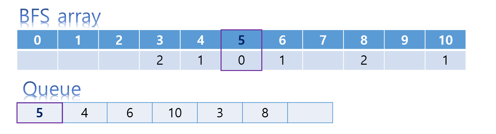

# BFS
> **다차원 배열에서의 탐색**  
>   
> - 첫번째 vis[][] = 1 초기화 잊지말 것  
> - 입력값이 붙어져있는지 떨어져있는지 체크    


> **each move one square per minute, vertically or horizontally (not diagonally).**  
> 매 분마다 한칸씩 수평또는 수직으로(비스듬하게 이동하지 않는다)  이동  `diagonal - 사선의, 대각선의`


## 1926 그림  

[BOJ 1926](1926.cpp)  


## 2178 미로탐색
[BOJ 2178](2178.cpp)
- **다차원 배열에서의 거리측정**  
    - _example 1_  

    |||||||
    | :--: | :--: | :--: | :--: | :--: | :--: |  
    | 0 | - | 8 | 9 | 10 | 11| 
    |1 |-|7|-|11|-|
    |2|-|6|-|12|13|
    |3|4|5|-|13|14|  

    - _example 2_  

    |||||||
    | :--: | :--: | :--: | :--: | :--: | :--: |  
    |0|-|6|7|8|-|
    |1|-|5|6|7|-|
    |2|3|4|5|6|7|
    |3|4|5|6|-|8|

- 이전 데이터
    - cur.x
    - cur.y
    ```cpp
    dist[nx][ny] = dist[cur.x][cur.y] + 1;
    ```  
- *std::fill*  
    - `std::fill(v.begin(), v.end(), -1);`

- 띄어쓰기가 없는 입력 데이터
    ```cpp
    string board[102];
    cin >> n >> m;
    for(int i = 0; i < n; i++)
        cin >> board[i];
    for(int i = 0; i < n; i++)
        fill(dist[i], dist[i]+m, -1);
        
    if(board[nx][ny] != '1' ) continue;// *** board  is string type but can be accessed by 2 dimension char type 
    ```

## 7576 토마토
[BOJ 7576](7576.cpp)  
> **BFS 하면서 큐에 쌓이는 순서는 반드시 거리순으로 되어있다**  


- 익은 토마토의 개수가 1개라면 익은 토마토의 해당위치를 시작점으로 BFS
- 근데 문제에서는 익은 토마토의 개수가 1개 이상인 경우도 있다  
- **시작점이 여러개인 BFS**  
    - *모든 시작점을 큐에 넣고 BFS*  


## 7569 토마토
[BOJ 7569](7569.cpp)

- Hint > 3차원이라고 해서 크게 다를건 없고, 단지 배열이 3차원이고 6개의 인접한 칸을 처리하기 위해 dx, dy, dz가 필요하게 됩니다. 구현할 때 STL tuple이라고 하는 것을 이용하면 좋습니다.  

- *STL tuple*


## 4179 불!  
[BOJ 4179](4179.cpp)  
> 탈출 조건이 있는 BFS

- 불에대한 전파속도 BFS 큐  
- 이차원 배열을 벗어난 경우를 다루는 조건
```cpp
if(nx < 0 || nx >= r || ny < 0 || ny >= c) { // if out of range -> succeded to escape two dimension array
    cout << steps[cur.x][cur.y] + 1;
    return 0;
}
```

<!-- 이렇게 시작점이 두 종류인 문제를 해결할 수 있게 됩니다. 그런데 시작점이 두 종류인 문제에 관해서 저희가 생각해야 할 점이 사실 추가로 있어요. 지금 이 방식이 가지고 있는 문제는 무엇인가 하면, 지금은 지훈이의 이동은 불의 전파에 영향을 받지만 불의 전파는 지훈이의 이동에 영향을 받지 않아서 불만 먼저 전파를 쭉 시키는게 가능했습니다. 그런데 예를 들어 시작점이 A, B 두 종류가 있고, A의 전파에 B가 영향을 주고 B의 전파에도 A가 영향을 준다고 해봅시다. 그런 상황을 생각해보면 어느 하나를 먼저 끝까지 전파시키는게 불가능합니다. 아쉽게도 이 문제는 백트래킹 기법을 추가로 알고 있어야 해결이 가능하기 때문에 당장 풀어볼 수는 없지만, 두 종류의 BFS에서 BFS를 돌 때 어느 하나가 독립적이지 않고 서로에게 영향을 준다면 지금 보여드린 방법으로는 해결할 수 없다는 것을 꼭 이해하셔야 합니다. 그런 상황에서는 시간 순으로 A와 B를 동시에 진행시켜야 합니다. 이 부분은 충분히 생각해볼 가치가 있고, 두 종류의 시작점 문제를 몇 개 풀다보면 지금 제가 한 얘기가 더 명확하게 이해가 갈 것입니다. 그 때 다른 사람의 코드를 찾아보거나 직접 고민하면서 시간 순으로 A와 B를 동시에 진행시킨다는 의미를 이해해보면 좋겠습니다. -->

## 1697 숨바꼭질
[BOJ 1697](1697.cpp)  

- BFS로 문제 접근하기  
      

- fill 함수를 이용하여 -1로 초기화하는 이유
    ```cpp
    if( fj[pos] ) continue;
    ```
    - 위와 같이 fj 배열을 fill로 -1로 초기화하지않은 경우에 fj[pos] 값이 음수인경우에도 if문 조건문을 통과한다. 오직 0일때만 조건문이 걸러지므로 아래 코드처럼 코딩하자  
    ```cpp
    for(int i = 0; i < n; i++)
        fill(fj[i], fj[i]+m, -1);
    if( fj[pos] != -1) continue;
    ```


- ranged-base for
    ```cpp
    for(int nxt : {cur - 1, cur + 1, cur * 2}) {
        
    }
    ```

